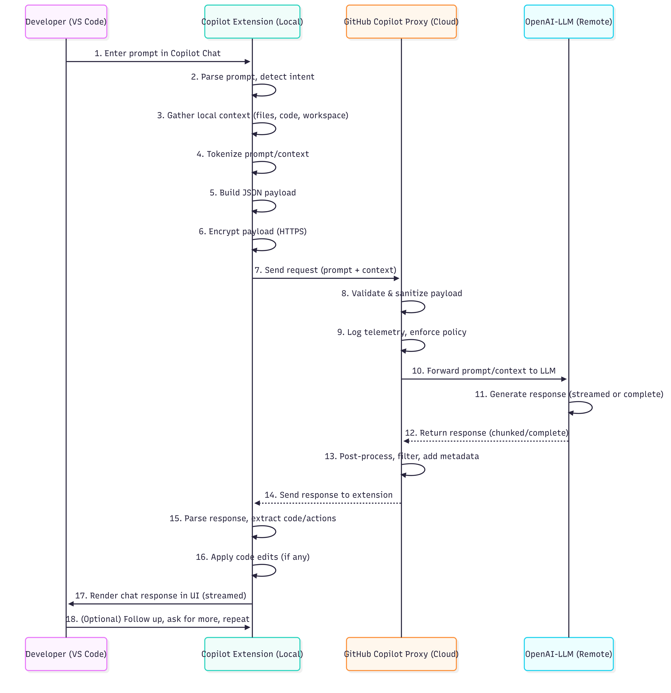

Here are the main files and code references for each Copilot Chat flow stage, with direct GitHub URLs for your repository (assuming the default branch is main):

---

### 1. Local (VS Code + Copilot Extension)
- **Chat logic, user input:**  
  [`src/extension/conversation/`](https://github.com/microsoft/vscode-copilot-chat/tree/main/src/extension/conversation/)
- **Inline chat features:**  
  [`src/extension/inlineChat/`](https://github.com/microsoft/vscode-copilot-chat/tree/main/src/extension/inlineChat/)
- **Prompt templates/utilities:**  
  [`src/extension/prompt/`](https://github.com/microsoft/vscode-copilot-chat/tree/main/src/extension/prompt/)
- **Intent detection:**  
  [`src/extension/intents/`](https://github.com/microsoft/vscode-copilot-chat/tree/main/src/extension/intents/)  
  `src/extension/intents/common/intents.ts`
- **Context gathering:**  
  [`src/extension/context/`](https://github.com/microsoft/vscode-copilot-chat/tree/main/src/extension/context/)  
  [`src/extension/typescriptContext/`](https://github.com/microsoft/vscode-copilot-chat/tree/main/src/extension/typescriptContext/)  
  [`src/extension/relatedFiles/`](https://github.com/microsoft/vscode-copilot-chat/tree/main/src/extension/relatedFiles/)  
  [`src/extension/search/`](https://github.com/microsoft/vscode-copilot-chat/tree/main/src/extension/search/)
- **Tokenization:**  
  `src/util/common/tokenizer.ts`

---

### 2. Copilot Extension (Local)
- **Prompt building:**  
  [`src/extension/prompt/`](https://github.com/microsoft/vscode-copilot-chat/tree/main/src/extension/prompt/)  
  [`src/extension/prompts/`](https://github.com/microsoft/vscode-copilot-chat/tree/main/src/extension/prompts/)
- **Endpoint selection & model metadata:**  
  `src/extension/prompt/vscode-node/endpointProviderImpl.ts`  
  `src/platform/endpoint/node/modelMetadataFetcher.ts`
- **Networking/request:**  
  `src/platform/networking/common/networking.ts`  
  `src/platform/endpoint/node/copilotChatEndpoint.ts`
- **Streaming/response handling:**  
  [`src/extension/codeBlocks/`](https://github.com/microsoft/vscode-copilot-chat/tree/main/src/extension/codeBlocks/)  
  [`src/extension/conversation/`](https://github.com/microsoft/vscode-copilot-chat/tree/main/src/extension/conversation/)

---

### 3. GitHub Copilot Proxy (Cloud)
- **Request sent from:**  
  `src/platform/endpoint/node/copilotChatEndpoint.ts`  
  `src/platform/networking/common/networking.ts`
- **Telemetry:**  
  `src/platform/telemetry/common/telemetry.ts`  
  `src/platform/telemetry/common/nullExperimentationService.ts`

---

### 4. OpenAI-LLM (Remote)
- **Endpoint definition:**  
  `src/platform/endpoint/node/copilotChatEndpoint.ts`  
  `src/platform/endpoint/common/endpointProvider.ts`

---

### 5. GitHub Copilot Proxy (Cloud)
- **Response handling:**  
  `src/platform/endpoint/node/copilotChatEndpoint.ts`  
  [`src/extension/conversation/`](https://github.com/microsoft/vscode-copilot-chat/tree/main/src/extension/conversation/)

---

### 6. Copilot Extension (Local)
- **Response parsing & UI update:**  
  [`src/extension/conversation/`](https://github.com/microsoft/vscode-copilot-chat/tree/main/src/extension/conversation/)  
  [`src/extension/inlineEdits/`](https://github.com/microsoft/vscode-copilot-chat/tree/main/src/extension/inlineEdits/)  
  [`src/extension/codeBlocks/`](https://github.com/microsoft/vscode-copilot-chat/tree/main/src/extension/codeBlocks/)
- **Code actions:**  
  [`src/extension/inlineEdits/`](https://github.com/microsoft/vscode-copilot-chat/tree/main/src/extension/inlineEdits/)  
  [`src/extension/tools/`](https://github.com/microsoft/vscode-copilot-chat/tree/main/src/extension/tools/)  
  [`src/extension/commands/`](https://github.com/microsoft/vscode-copilot-chat/tree/main/src/extension/commands/)

---

### 7. Local (VS Code)
- **UI rendering:**  
  [`src/extension/conversation/`](https://github.com/microsoft/vscode-copilot-chat/tree/main/src/extension/conversation/)  
  [`src/extension/inlineChat/`](https://github.com/microsoft/vscode-copilot-chat/tree/main/src/extension/inlineChat/)  
  [`src/extension/codeBlocks/`](https://github.com/microsoft/vscode-copilot-chat/tree/main/src/extension/codeBlocks/)

---

Let me know if you want direct links to specific functions or classes!